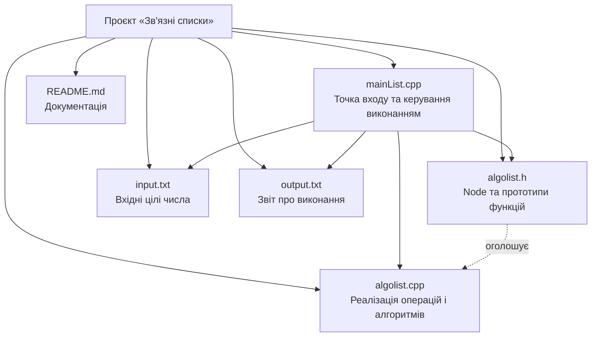

## ЗВ'ЯЗНІ СПИСКИ 

## Структура проекту

```mermaid
flowchart TD
	Project[Проєкт «Зв'язні списки»]

	Project --> Header[algolist.h<br/>Node та прототипи функцій]
	Project --> Implementation[algolist.cpp<br/>Реалізація операцій і алгоритмів]
	Project --> Entry[mainList.cpp<br/>Точка входу та керування виконанням]
	Project --> Input[input.txt<br/>Вхідні цілі числа]
	Project --> Output[output.txt<br/>Звіт про виконання]
	Project --> Docs[README.md<br/>Документація]

	Entry --> Header
	Entry --> Implementation
	Entry --> Input
	Entry --> Output
	Header -. оголошує .-> Implementation
```

## Запуск 

- g++ -std=c++17 mainList.cpp algolist.cpp -o mainList
- ./mainList 